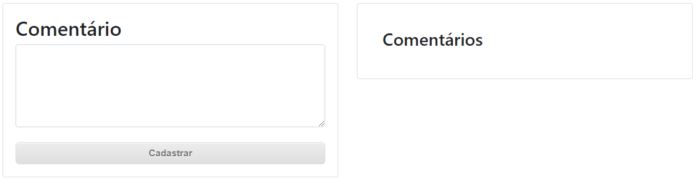
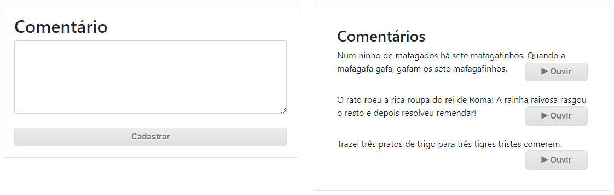

## What is it?

Node.js application with Mysql image on Docker.
The idea is a simple screen divided into 2 panels, where on the left it is possible to add comments and on the other side you can view all comments with an option to listen to the text through the ibm watson API

<p align="center">


</p> 
<p align="center">

</p> 

### The database configs

use the command below to generate the database
````
CREATE DATABASE comentarios
````

in the file **/database/database.js**  it's possible to change the connection settings to the database.
```
const connection = new Sequelize('comentarios','root','root',{
    host:'localhost',
    dialect:'mysql'
});

```
### In the file /index.js
Change the apikey and the url generated in the IBM account.
```
        const textToSpeech = new TextToSpeechV1({
            authenticator: new IamAuthenticator({ apikey: '**YourApiKeyHere**' }),
            url: '**YourURL**'
 });
``` 
### In the terminal
Accessing the terminal by navigating into the project and then execute the command:
***npm start***

### Accessing the application in the browser: 
**http://localhost:8080/**


